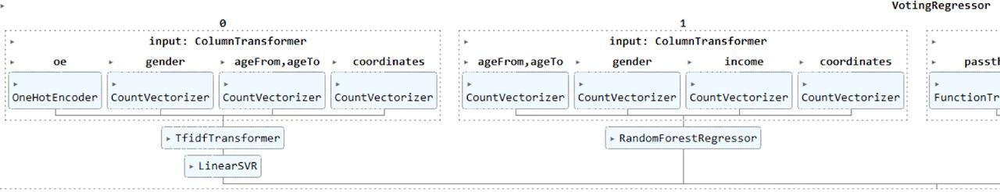

# advertising-placement-optimization
A web tool that uses historical targeted advertising campaign data and machine-learning models to recommend the optimal placement of a fixed number of ad points across a city map (polygons / sectors) to maximize audience reach (coverage).

---

## Quick summary

**What it does:** given historical campaign data and a requested number of advertising points `N`, the app predicts and returns the `N` map locations (points / sectors) that maximize total audience coverage for a chosen audience segment. The system produces point recommendations, heatmaps and sector-based predictions via a web interface.

**Who it's for:** marketing analysts, out-of-home advertisers, local ad agencies and data scientists who want an interactive tool to optimize physical advertising placement.

---

## Highlights / Key features

* Interactive map UI (Leaflet) with: point recommendations, heatmap layer, and polygon selection tools.
* Audience filtering by age range, income level and gender; demographic features are encoded in the pipeline.
* Request `N` suggested advertising points with coordinates and estimated coverage values (marginal and total contributions).
* Polygon tools — choose existing city sectors or draw custom polygons and get per-sector predictions.
* Upload historical campaigns (JSON) for visualization and optional model re-use.
* Modular codebase: preprocessing, model training/experiments, and map/frontend are isolated.
* Ensemble modeling (LinearSVR, RandomForest, ExtraTrees, LightGBM) with one-hot encoding and simple text/vector features for robust heatmap predictions.
* Scalable, asynchronous-friendly frontend.




---

## Project structure (short)

```
.
├── map/                     # Web app (Flask or FastAPI + Leaflet front-end)
│   ├── run.py               # entrypoint for local dev server
│   ├── model.py             # model loader and prediction API
│   ├── storage.py           # persistence / demo dataset loader
│   ├── templates/
│   └── static/              # JS, CSS, leaflet plugins (heatmap)
├── models/                  # notebooks, training scripts, models.md
├── preprocessing/           # ETL and data-preparation utilities
├── assets/                  # place for screenshots and exported slides
└── readme.md                # this file
```

---

## Installation (quick)

> Run from `map/` directory or update paths accordingly.

1. Create and activate virtual environment

```bash
python -m venv venv
source venv/bin/activate    # macOS/Linux
# venv\Scripts\activate   # Windows PowerShell
```

2. Install dependencies

```bash
pip install -r map/requirements.txt
```

3. Download and place pre-trained model weights in `map/` (same folder as `run.py`).

4. Start server

```bash
python map/run.py
```

5. Open the printed local URL (usually `http://127.0.0.1:5000`).

---

## Usage (web UI)

* **Map**: set target audience and number `N`, click **Predict** → app returns `N` recommended locations. Click a point to show lat/lon and estimated coverage.
* **Heatmap**: generate a continuous coverage density map for the selected audience segment.
* **Polygons**: pick a city sector or draw a custom polygon and request predictions within it.
* **Upload**: import historical campaigns (JSON) via the **File** tab — the app will visualize them and (optionally) use them to augment local analyses.

---

## Data format / Example JSON

Expected minimal structure for uploaded campaign files (example):

```json
[
  {
    "campaign_id": "camp_2023_01",
    "surfaces": [
      {"lat": 55.751244, "lon": 37.618423, "surface_id": "s1", "coverage": 120},
      {"lat": 55.752000, "lon": 37.620000, "surface_id": "s2", "coverage": 95}
    ],
    "combined_coverage": 180,
    "audience": {"age_min": 25, "age_max": 34, "income_level": "mid", "gender": "female"},
    "date": "2023-04-15"
  }
]
```

Notes:

* `coverage` may be omitted; the app will still import and visualize points without explicit coverage values.
* Keep coordinates as decimal latitude/longitude.

---

## Models & prediction pipeline (concise)

* Preprocessing: import historical campaigns, deduplicate, remove out-of-scope cities, compute auxiliary features (e.g., distance to city center), and encode demographic features. See `preprocessing/marks.py` for implementation.
* Modeling: ensemble-based heatmap/regression models (LinearSVR, RandomForest, ExtraTrees, LightGBM) trained with one-hot/text-like vectorization for categorical inputs. The ensemble produces stable coverage estimates per-surface and for polygon aggregations.
* Selection/optimization: a greedy marginal-coverage algorithm ranks candidate surfaces by predicted marginal gain (accounting for overlap); the top `N` are returned. Alternatives like integer programming or constrained submodular optimization can be added in future.

---

## Re-training & experiments

Notebooks and training experiments live in `models/` (e.g., `model_heatmap.ipynb`, `model_wnn3_train.ipynb`). To retrain:

1. Follow preprocessing steps to produce `train.json`/`train.csv`.
2. Run the notebooks to fit model variants and export weights in the format expected by `map/model.py`.
3. Replace the weights file in `map/` and restart the server.

---

## Improvements (roadmap)

* Add unit tests for preprocessing and model-serving logic.
* Provide Dockerfile and docker-compose for reproducible deployment.
* Add automated evaluation scripts and a model card describing training data provenance, biases and limitations.
* Improve JSON schema validation in the upload UI with explicit warnings.
* Add a lightweight API for programmatic predictions (REST or gRPC) and authentication for multi-user usage.

---


## Contributing

Contributions are welcome. Fork the repository, create a feature branch, and open a pull request. Prefer small, focused PRs.

---

## License

MIT License — see `LICENSE` file.

---
